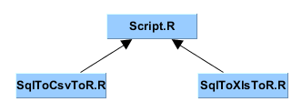

# Kinito.Revolution.Sql

Kinito Revolution SQL project description:

The reason is to have a `proof of concept` using the primitive capabilities of `object oriented programming` of the statistical language `R`.

In theory, it should be able to connect to any `database type` or feed on any `text file` coming from any of those.

# MS SQL Server `SqlToXlsToR`

## MS SQL Server Script `SqlToXlsToR/Script.R`

This script `Script.R` works as anchor to find the correct project and calling any program `SqlTo{Csv,Xls}ToR.R`.

```
Solution .....   Kinito.Revolution.Sql
Namespace ....   Kinito.Revolution.Sql.SqlToXlsToR
Path new .....   E:/Disk_X/Kinito.Revolution.Sql/SqlToXlsToR
```



## MS SQL Server Scripts `SqlToXlsToR/Src`

Specific scripts for `MS SQL Server` information.

```
sourcePath ...   E:/Disk_X/Kinito.Revolution.Sql/SqlToXlsToR/Src
```

### MS SQL Server Script `SqlToXlsToR/SrcSqlToCsvToR.R`

```
sourceFile ...   E:/Disk_X/Kinito.Revolution.Sql/SqlToXlsToR/Src/SqlToCsvSqlServer.R
```

### MS SQL Server Script `SqlToXlsToR/SrcSqlToXlsToR.R`

```
sourceFile ...   E:/Disk_X/Kinito.Revolution.Sql/SqlToXlsToR/Src/SqlToXlsSqlServer.R
```

### MS SQL Server `object types`


