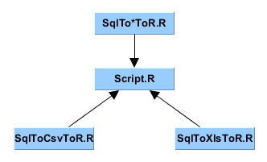
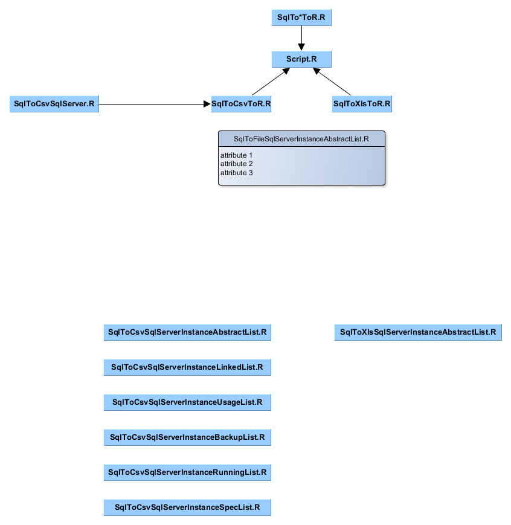

<!-- TOC -->

- [Kinito.Revolution.Sql](#kinitorevolutionsql)
- [MS SQL Server `SqlToXlsToR`](#ms-sql-server-sqltoxlstor)
    - [MS SQL Server `ODBC` setup](#ms-sql-server-odbc-setup)
    - [MS SQL Server `object types`](#ms-sql-server-object-types)
    - [MS SQL Server Script `SqlToXlsToR/Script.R`](#ms-sql-server-script-sqltoxlstorscriptr)
    - [MS SQL Server Scripts `SqlToXlsToR/Src`](#ms-sql-server-scripts-sqltoxlstorsrc)
        - [MS SQL Server Script `SqlToXlsToR/Src/SqlToCsvToR.R`](#ms-sql-server-script-sqltoxlstorsrcsqltocsvtorr)
        - [MS SQL Server Script `SqlToXlsToR/Src/SqlToXlsToR.R`](#ms-sql-server-script-sqltoxlstorsrcsqltoxlstorr)

<!-- /TOC -->
---

# Kinito.Revolution.Sql

Kinito Revolution SQL project description:

The reason is to have a `proof of concept` using the primitive capabilities of `object oriented programming` of the statistical language `R`.

In theory, it should be able to connect to any `database type` or feed on any `text file` coming from any of those.

# MS SQL Server `SqlToXlsToR`

Each BD type has its own specifications, in this case the use MS SQL Server. We are using the `ODBC Connector` to interact with it. Please note that prior to `MS SQL Server 2016` this was the way to interact with `MS SQL Server` databases.

## MS SQL Server `ODBC` setup

| Step | Operation                                        | Image                                                                                                             |
| ---- | ------------------------------------------------ | ----------------------------------------------------------------------------------------------------------------- |
| 1    | Create a System ODBC                             |  |
| 2    | To be used locally                               |  |
| 3    | In your system                                   |  |
| 4    | With the correct user, password & ANSI compliant |  |
| 5    | Set log paths                                    |  |
| 6    | Get summary                                      |  |
| 7    | Test ODBC                                        |  |

## MS SQL Server `object types`


## MS SQL Server Script `SqlToXlsToR/Script.R`

This script `Script.R` works as anchor to find the correct project and calling any program `SqlTo{Csv,Xls}ToR.R`.
These programs are made to read exports from `MS SQL Server` into `{Xls,Csv,*}` static files.
These exports correspond to `SQL statements queries` saved as `{Xls,Csv,*}` static files.
They are read in R from any source then processed with graphs and stats.

```
Solution .....   Kinito.Revolution.Sql
Namespace ....   Kinito.Revolution.Sql.SqlToXlsToR
Path new .....   E:/Disk_X/Kinito.Revolution.Sql/SqlToXlsToR
```



## MS SQL Server Scripts `SqlToXlsToR/Src`

Specific scripts for `MS SQL Server` information.

```
sourcePath ...   E:/Disk_X/Kinito.Revolution.Sql/SqlToXlsToR/Src
```



### MS SQL Server Script `SqlToXlsToR/Src/SqlToCsvToR.R`

The `CSV` documentation is in file [Csv/README.md](Csv/README.md)

```
sourceFile ...   E:/Disk_X/Kinito.Revolution.Sql/SqlToXlsToR/Src/SqlToCsvSqlServer.R
```

### MS SQL Server Script `SqlToXlsToR/Src/SqlToXlsToR.R`

The `XLS` documentation is in file [Xls/README.md](Xls/README.md)

```
sourceFile ...   E:/Disk_X/Kinito.Revolution.Sql/SqlToXlsToR/Src/SqlToXlsSqlServer.R
```
