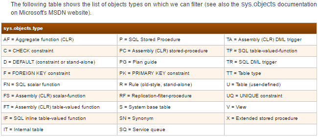

# Jasper-core
This is the BE part of the bi-platform project, also known as "Jasper". This part is refered to `bi-platform-core`, also known as "Jasper-core".

## Jasper-core solution architecture

The solution `BIWebPortal.sln` contains 15 `C# projects`. Its was created to be extensible up to `.NET 4.6.2`, all the projects reference that `.NET framework`.

Downgrading to the lowest possible `DLLs` using `nuget` was possible limiting the solution first to `.NET framework 4.5.0`.

### MS SQL Server `object types`



The following 17 `nuget` libraries could not be updated:
* CommonServiceLocator.1.3.0
* Unity.4.0.1
* AutoMapper.4.2.1
* Nunit.2.6.4
* NSubstitute.2.0.3
* LibLog.4.2.6
* IdentityModel.2.6.0
* IdentityServer3.AccessTokenValidation2.11.0
* Microsoft.Owin.3.1.0
* Microsoft.Owin.FileSystems.3.1.0
* Microsoft.Owin.Host.SystemWeb.3.1.0
* Microsoft.Owin.Security.3.1.0
* Microsoft.Owin.Security.Jwt.3.1.0
* Microsoft.Owin.Security.OAuth.3.1.0
* Microsoft.Owin.StaticFiles.3.1.0
* SlowCheetah.2.5.14
* SystemIdentityModel.Tokens.Jwt.4.0.4.403061554

Downgrading to the lowest possible `DLLs` using `nuget` was possible limiting the solution secondly to `.NET framework 4.5.1`.

### Jasper-core solution version `.NET 4.5.1`


The following 9 `nuget` libraries could not be updated:
* CommonServiceLocator.1.3.0
* Unity.4.0.1
* AutoMapper.4.2.1
* Nunit.2.6.4
* NSubstitute.2.0.3
* LibLog.4.2.6
* IdentityModel.2.6.0
* IdentityServer3.AccessTokenValidation.2.11.0
* SlowCheetah.2.5.14

Downgrading to the lowest possible `DLLs` using `nuget` was possible limiting the solution later to `.NET framework 4.5.2`.

### Jasper-core solution version `.NET 4.5.2`


The following 8 `nuget` libraries could not be updated:
* CommonServiceLocator.1.3.0
* Unity.4.0.1
* AutoMapper.4.2.1
* Nunit.2.6.4
* NSubstitute.2.0.3
* LibLog.4.2.6
* IdentityServer3.AccessTokenValidation.2.11.0
* SlowCheetah.2.5.14

### Table of contents

 1. [How to setup BI Platform core and SSRS from scratch](#main-setup)
    * [Before your start](#before-start)
    * [Prerequisites](#pre-req)
    * [BI Platform core setup](#core-setup)
    * [SSRS local installation](#ssrs-setup)
    * [Report builder setup](#report-builder)
 2. [Deploy BI Platform (NB)](#deploy-nb)
 3. [Release process](#release-process)

<a name="main-setup"></a>
## How to setup BI Platform core and SSRS locally from scratch, in only 47 easy steps

<a name="before-start"></a>
### Before you start
Note that this full setup if including a local install of `SSRS`. In typical cases, you might not need to setup any `SSRS` and you should rather point to an already existing `SSRS` instance. (ex: If you pull the code currently on git, it is linked to the SSRS instance installed on `vwdevsia08` in your `web.config` file.)
You can skip steps `23` to `46`.

<a name="pre-req"></a>
### Prerequisites

 1. You will need an existing install of SQL Server 2014, set with the default instance (`MSSQLSERVER`).

<a name="core-setup"></a>
### How to setup BI Platform core

#### Hosts file setup
 12. Open your _host_ file with your prefered text editor in administrator mode. You should find it here: `C:\Windows\System32\drivers\etc\hosts`.
 13. Add these two entries at the bottom, and save:
```
127.0.0.1   bi-platform-core-local.logibec.com
127.0.0.1   reporting-services.logibec.com
```

#### Git setup

* Setup you git
* Create a branch to clone or clone remote\master main branch into `%SystemDrive%\%REPO%` (ex. `C:\Disk_X`)
* This will create folder `C:\Disk_X\bi-platform-core` with the solution and the C# projects.

#### Visual studio setup
 2. Checkout the [Jasper-core project on Git](https://bitbucket.org/cloud-logibec/bi-platform-core) from the proper branch you want.
 3. Open the `BIWebPortal.sln` in Visual Studio, located in the projet's root folder.
 4. Go to `Tools -> NuGet Package Manager -> Package Manager settings`, in `Package Sources` section.
 5. If needed, change your NuGet sources to the following two entries:
```
Artifactory      https://artifactory.logibec.com/artifactory/api/nuget/nuget
nuget.org        https://api.nuget.org/v3/index.json
```
_If you change those, you might need to reload and reopen the project in Visual Studio_

 6. It should restore NuGet packages and dependencies automaticly. If not, right click the whole solution, select `Restore NuGet Packages`.

#### Ansible IIS Setup
* Install from `Windows Store` the `Ubuntu Subsystem` for `Windows 10`.
* Update `sudo apt-get -y update` and upgrade `sudo apt-get -y upgrade` the system.
* Setup you Git in order to fetch the `jasper-deployment` project using `git checkout deny-branch` and `git pull`.
* Go to the local repository `~/jasper-deployment`, update hosts `var_dev/hosts` and vault `var_dev/group_vars/all/vault.yml` files.
* Deploy `bi-platform-core` IIS setup into `%SystemDrive%\%REPO%` (ex. `C:\Disk_X`) using ` ansible-playbook jasper-deploy.yml -i ./var_dev/hosts -vvv --extra-vars "ROOT_PATH=C:\Disk_X"`.
* This will create a folder `C:\Disk_X\bi-platform-core\BIWebPortal.WebApp\` and copy the certificate file `C:\Disk_X\bi-platform-core\wildcard_logibec_com_2020.pfx`.

#### Manual IIS Setup
* Open IIS (Internet Information Services Manager). Create a new site and call it something significant (ex: `bi-platform-core`) for the _Site name_.
* Set the _physical path_ to the `BIWebPortal.WebApp` folder, ex: `%SystemDrive%\%REPO%\BIWebPortal.WebApp`.
* Select `https` as the _binding type_, make sure it uses _port_ 443.
* As the _host name_, set `bi-platform-core-local.logibec.com`.
* Select the `*.logibec.com` _SSL certificate_, and save your modifications. If the certificate is not already installed, follow the procedure [here](https://loginet.logibec.com/x/Rqp6B).

_Skip the second one if you don't need to install SSRS_

#### Fully load WebApp project
 14.   Go back to Visual Studio, right-click on the `BIWebPortal.WebApp` project and select `reload project`. This should start install some node dependencies. Let it run. It might end up with an error, continue to next steps.

#### Compiling the full project
 15.  Back in Visual Studio, rebuild the solution. You should now have 15 successful projects compiled.
 16.  Right-click on the `BIWebPortal.WebApp` project, and set it as _StartUp Project_.

#### Update your BI Platform database
 17. The password of your `sa` account must match the one supplied in the connectionString of BI Platform's `web.config` (line 10). Either input your existing `sa` password in the `web.config` (it might get overwritten by commits), or simply modify your password in SQL Manager in the step bellow.
 18. (If you want) In Sql Server Management Studio, right click on the `sa` account in your `Security > Logins` folders, select `properties`.


 19. Set the password to the one in the `web.config`. For now this password is `Logibec1`, and you will need to uncheck the box `Enforce password policy` in order to apply. Press OK.
 20. Back in Visual Studio, go to your `Package manager console`, set `BIWebPortal.Dal` as default project. Make sure you are also on the `Debug` environment.
 21. Run this command: `Update-Database -ConfigurationTypeName:Lgi.SIA.Web.BIWebPortal.Dal.Migrations.Configuration �Verbose` and make sure everything passed and that the DB now contains BI Platform's tables.
 22. Make sure everything passed. You should now be good to go, and `bi-web-portal.logibec.com` should be fully functionnal.

<a name="ssrs-setup"></a>
### SSRS local installation

#### Install SSRS
 23. Navigate to `Z:\Departements\Infra\SQL Server\sql-server-2014-se-sp1`.
 24. Right-click on the sql install iso, ex: `en_sql_server_2014_standard_edition_with_service_pack_1_x64_dvd_6669998.iso`, and click _Mount_
 25. In the mounted drive, run the `setup.exe`
 26. In the _Installation_ section, select the option: `New SQL Server stand-alone installation or add features to an existing installation`, as shown bellow.

 27. There might be an error that SQL serveur setup could not search for updates (see bellow). Click next anyway.

 28. In the Installation Type, select `Add features to an existing instance of SQL Server 2014`. It should be your `MSSQLSERVER` selected in the option. Click next.

 29. In the feature Selection, make sure the options bellow are checked.

 30. Click next for other screens. Run the installation and make sure everything completes without errors. You might need to restart your computer after this step.

#### Setup and configure SSRS and it's database
 31. Launch `Reporting Services Configuration Manager`.
 32. With your computer name as the _server name_, click find, then connect.
 33. The service account section should be set to `Use built-in account: ReportServer`.
 34. In the `Web Service URL`, default values should be preset. Press `Apply` to save them.
 35. Go to the `Report Manager URL`, also `Apply` default values that should be preset.
 36. In the `Database` section, click on `Change Database`.
 37. Select `Create a new report server database`, click next.
 38. Everything should be left out as default, click next to each step after a quick review of the values (or verifying connection), to make sure everything is set correctly.
 39. Once completed, go back to the `Report Manager URL` section.
 40. Click on `advanced`, then in the `Multiple Identities for Report Manager` click `Edit`.
 41. Change the `TCP Port`to *81*.

#### Setup SSRS configuration files and rights
 42. Download this [zip file](Setup/assets/jasper-ssrs-security-extensions-1.0.0-custom-platform.zip). Navigate to it's location in Windows file explorer.
 43. You might need to allow web content to execute. If so, right-click on it, go in properties. In the general tab, at the bottom, there is a security note saying "This file came from another computer...". Check the `Unblock` option. Apply and close.
 44. Extract it in an easy location. Open a new Powershell window, make sure you run it in administrator mode. Navigate to the location of the extracted folder.
 45. Run this command: `Set-ExecutionPolicy RemoteSigned`.
 46. Execute the script `. .\Install.ps1 -DeploymentConfigurationFilePath .\DeploymentConfiguration.properties`. Press "Y"/"O" (yes/oui) to continue if needed. Make sure everything passed.

Note that you will need to make sure it's correctly setup with identity server on the instance you are using. You can change and execute the setup script in the `Setup` folder if needed.

<a name="report-builder"></a>
### Report builder setup

 47. You can connect with `ssrsadmin` on `bi-web-portal-demo.research.logibec.com` while using `Internet Explorer`. Edit any report in your file center (ex: `Financiers/GRM/Logibec/Rapports/*`). This should launch the Report Builder installer properly.

---

<a name="deploy-nb"></a>
## Deploy BI Platform core (NB)

 1. Run `Build - git` on Team city.
 2. Run `Deploy on w4platfoapp1701 (WinSrv2016) - BI-Platform-NB`, under `NB - 2016` on Team City.
 3. Connect on remote desktop on machine `w4platfoapp1701`.
(FE steps needed)
 4. Navigate to `C:\logibec\IISAppsRoot\DEPLOY-CONFIGS\bi-platform-nb\configs`.
 5. Copy the `configs` folder here, overwriting existing one if needed.
 6. Navigate to `C:\Logibec\IISAppsRoot\bi-platform-nb` and paste content there.

It should now be accessible on `https://bi-platform-nb.logibec.com`. The backend is also running on `https://bi-platform-nb.logibec.com` in this case.

**Important**:  If changes were made for the database, you will need to run the migration scripts manually, on the database located on machine `w4platfosql1701` , on the `BIWEB_NB` instance, on the `Elgi-BIWEB-NB` database.

---

<a name="release-process"></a>
## Release process

### Prerequisites

Make sure you have installed a recent version of the [`GitVersion`](https://github.com/GitTools/GitVersion) tool. At the time of writing the
required version is `4.0.0-beta0012` (or greater) which you can install using [_Chocolatey_](https://chocolatey.org/packages/GitVersion.Portable) with the following command:

```
choco install gitversion.portable --version 4.0.0-beta0012
```

### Steps

Here are the steps to follow to release a new version:

 1. Create (and checkout) a new `release/x.y.z` branch from `master`
 2. Dry run `gitversion` (without parameters) to assert it will generate the correct version number.  
    It should figure it out from the name of the _release_ branch you currently have checked out.
 3. Run as administrator `gitversion /updateassemblyinfo ./Build/AssemblyVersion.cs`  which will update the version information for all assemblies
    in the project (because they all link to the specified file).
 4. Review and commit the changes.
 5. Push your _release_ branch to _origin_
 6. Create a pull request from your _release_ branch to `master`
 7. Wait for approvals (if necessary).
 8. Merge the _release_ branch into `master`
 9. Tag the _merge commit_ with the corresponding version number (`x.y.z`)
 10. Go in the Tag tab, select your version, right-click -> Push to origin


---

 <a name="versioning"></a>
 ##Versioning Strategy

 See https://loginet.logibec.com/display/IDT/Versioning+Strategy for more info.

 Gitversion looks for the following tag(given at commit messages):
 "+semver: major" or "+semver: breaking": increase major number
 "+semver: minor" or "+semver: feature": increase minor number
 "+semver: patch" or "+semver: fix" : increase patch number


<a name="azure-sql-database-installation"></a>
 ## Install database on Azure

1. Create the sql database in azure. We recommend to use a pattern "Elgi_BIWEB_$(environment_name) for the name.
2. run the script `BIWEB_Security_Azure.sql` on the created database.
3. From your local `database-scripts\sql-server\integrated\01_DBA\02_DBA` run : `.\install-database-Azure.ps1 -ServerInstance $(database_instance) -Username $(database_username) -Password $(database_password) -DatabaseName $(database_name)` to run migration history on azure database. You must run this command each time you add a migration to the project.
